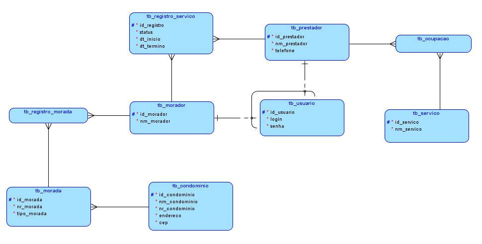

<h1>FIAP Fase 2 : Atividade 3</h1>

<h3>Início</h3>

Prosseguindo com o nosso `track record`, é chegado o momento de adicionarmos serviços `RESTful` ao nosso projeto. Seguindo a mesma linha que foi elaborada no <a>projeto do capítulo 5 da fase 1</a>, vamos elaborar um sistema que facilite o encontro de moradores de condomínios com prestadores de serviços. Nosso novo modelo de negócios ficou da seguinte forma:

 O que muda desse modelo em relação ao anterior é que agora estamos adicionando acessos para a nossa aplicação. Tanto `Morador` quanto `prestador` vão precisar ter um login e uma senha de acesso caso desejem entrar para utilizar.

Criamos a <b>tb_usuario</b> para armazenar os acessos. <b>tb_usuario</b> e <b>tb_prestador</b> vão herdar os dados armazenados dentro da tabela.

A relação entre as tabelas será de 1x1. `Morador` e `Prestador`podem ter apenas um `Usuario de acesso`.

 <h3>OBJETIVO DO PROJETO:</h3>

Este projeto tem como objetivo mostrar as operações CRUD dessas entidade utilizando REST. O documento terá os seguintes passos: <b>1) Demonstrando os metodos GET, PUT, POST e DELETE; 2) Funcionalidades da aplicação; 3) Considerações finais / Instalação</b>

