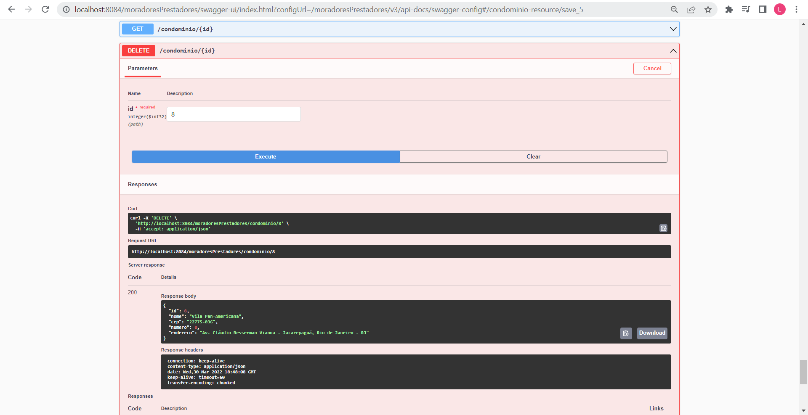

<h1>FIAP Fase 2 : Atividade 3</h1>

<h3>Início</h3>

Prosseguindo com o nosso `track record`, é chegado o momento de adicionarmos serviços `RESTful` ao nosso projeto. Seguindo a mesma linha que foi elaborada no <a href="https://github.com/Amorim-cyber/fiap2_fase1_cap5">projeto do capítulo 5 da fase 1</a>, vamos elaborar um sistema que facilite o encontro de moradores de condomínios com prestadores de serviços. Nosso novo modelo de negócios ficou da seguinte forma:

 O que muda desse modelo em relação ao anterior:

* Agora estamos adicionando acessos para a nossa aplicação. Tanto `Morador` quanto `Prestador` vão precisar ter um login e uma senha de acesso caso desejem entrar na aplicação.

* Criamos a <b>tb_usuario</b> para armazenar os acessos, <b>tb_usuario</b> e <b>tb_prestador</b> vão herdar os dados armazenados dentro da tabela.

* A relação entre as tabelas será de 1x1. `Morador` e `Prestador`podem ter apenas um `Usuário de acesso`.
* Também adicionamos mais dados para <b>tb_condominio</b> com o intuito de incluir restrições. Não será aceito `Condomínios `com  cep e número repetidos.

 <h3>OBJETIVO DO PROJETO:</h3>

Este projeto tem como objetivo mostrar as operações CRUD dessas entidade utilizando REST. O documento terá os seguintes passos: <b>1) Demonstrando os metodos GET, PUT, POST e DELETE; 2) Considerações finais / Instalação</b>

 <h3>Demonstrando os métodos GET, PUT, POST e DELETE</h3>

Optei por mostrar os métodos utilizando a documentação do `swagger` pela sua praticidade. 

Estou utilizando o banco de dados `postgres` para realizar a armazenagem dos dados. As consultas estão sendo realizadas via `visual studios code` com uma extensão que possibilita a conexão com o banco.

Clique <a href="http://localhost:8084/moradoresPrestadores/swagger-ui" >aqui</a> para ter acesso a documentação. (:construction: link ainda local :construction:)   

* <B>POST</B>

  O comando POST possibilita incluir novos dados ao nosso banco, no exemplo abaixo estou incluindo um novo condomínio.

  

  

  Após executamos a solicitação, vamos receber o corpo do objeto criado e o codigo de sucesso 201.

   

  

  Configuramos o programa para não criar novos condomínios que tenham o mesmo número e cep existentes no banco. Caso haja alguma inclusão desse tipo, vamos receber um erro de código 422 informando que já existe um condomínio com estes dados.

   

  

  Consultando nosso banco, podemos observar que o condomínio foi inserido com sucesso.

  

  

  

* <B>GET</B>

  O comando GET tem o papel de retornar nossas entidades armazenadas no banco em formato de objeto, podemos retornar um ou mais elementos.

  No exemplo abaixo, retornamos apenas um único condomínio por meio da sua chave de identificação.

  

  

  

  Podemos chamar mais de um condomínio se quisermos.  

  

  

  

  Deixo aqui esse <a href="assets/GetAndPost.mp4">vídeo</a> demonstrando os métodos POST e GET.

  <i>Obs: No vídeo era para ter dito "postman" ao invés de "postgres" na hora de abrir o swagger</i>

* <b>PUT</b>

  O comando PUT atualiza dados de uma entidade já existente no banco. O programa irá retornar o elemento com os atributos alterados junto com o código 200 de sucesso. 

  

  

  Atenção quando for atualizar, o comando só irá ter êxito se preencher os dados da forma correta além de fornecer um id já existente no banco.  Veja <a href="assets/Put.mp4" >aqui</a> o vídeo de demonstração.

* <B>DELETE</B>

  O comando DELETE exclui uma determinada entidade dando seu id de identificação. Ao deletar o programa retorna o corpo do objeto deletado e código 200 de sucesso.

  

  

  Caso queira deletar uma entidade que tenham uma chave estrangeira (Condomínio por exemplo) precisa observar se ela não possui relação com outras entidades (Morada por exemplo), quando isso ocorrer é necessário deletar/mudar as entidades da qual ela tem relação antes de deleta-la. Clique <a href="assets/Delete.mp4" >aqui</a> para ver demonstração.

<h3><a href="https://github.com/Amorim-cyber/fiap2_fase2_atividade3" >CLIQUE AQUI PARA OLHAR O GITHUB DESTE PROJETO</a></h3>

